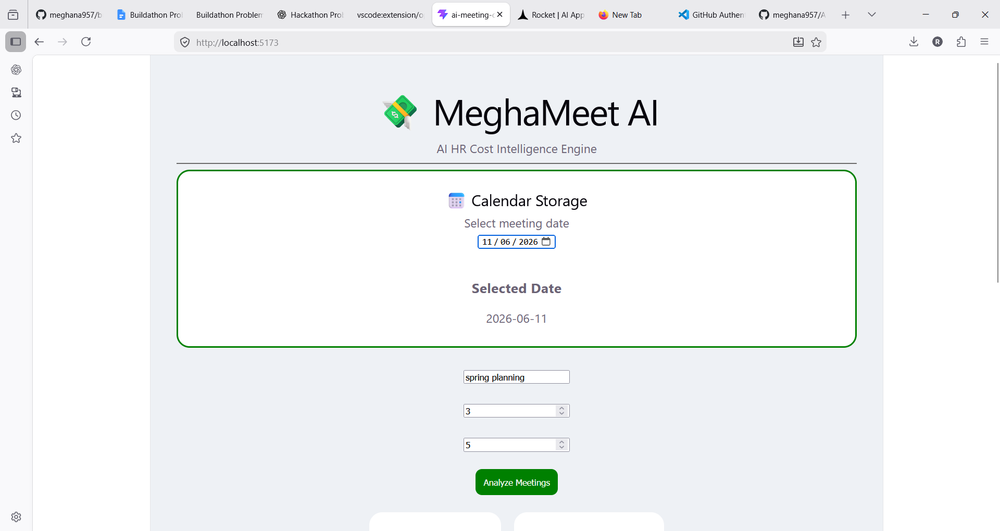
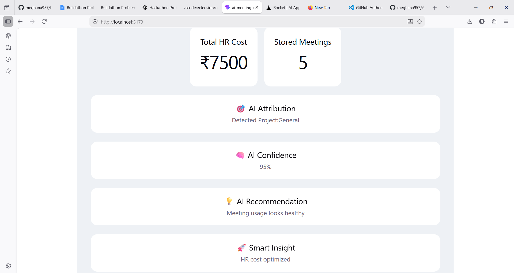

# Project Name

MeghaMeet AI — AI HR Cost Intelligence Engine

---

## Attendee Details

**Name:** Meghana Reddy

**GitHub Username:** meghana957

**LinkedIn Profile:**
https://www.linkedin.com/in/meghana-reddy-mittapally-024312375

**GitHub Project Repository:**
https://github.com/meghana957/AI-meeting-cost-intelligence

---

## Problem Statement Selected

HR Cost Intelligence Engine

---

## Project Description

MeghaMeet AI is a calendar-driven HR Cost Intelligence dashboard designed to help organizations understand how employee meeting activity contributes to project expenditure.

Users select a meeting date, enter meeting details, and the system estimates HR cost automatically.

The dashboard generates project attribution, AI confidence, recommendations, and smart insights to support decision-making.

This solution improves cost visibility and helps reduce unnecessary meeting spending.

---

## Approach

I approached the problem by focusing on a calendar-first workflow.

User Flow:

Calendar Selection
→ Meeting Input
→ HR Cost Calculation
→ AI Project Attribution
→ Dashboard Analytics
→ Recommendations

The system calculates estimated HR expenditure using meeting duration and employee participation.

AI-based logic assigns meetings to projects and generates business insights.

This approach converts meeting activity into measurable organizational cost.

---

## Tech Stack and Tools Used

**Frontend:** React.js, HTML, CSS

**Backend:** Not implemented (MVP)

**Database:** React useState (temporary local storage)

**AI Tools/API:** Rule-based AI attribution logic

**Cloud/Deployment:** Localhost

**Other Tools:** VS Code, GitHub

---

## Key Features

1. Calendar Storage Dashboard
2. HR Cost Calculation
3. AI Project Attribution
4. AI Confidence Score
5. Smart Recommendations
6. Monthly Cost Tracking
7. Smart Insights Dashboard

---

## What is Working?

* Calendar-based workflow
* Meeting data input
* HR cost estimation
* Dynamic dashboard
* Project attribution
* Recommendations
* Insight generation

---

## What is Still in Progress?

* Google Calendar integration
* Persistent database support
* Advanced AI prediction
* Deployment and hosting
* Monthly analytics improvements

---

## Screenshots or Demo

**Deployed Link:** Not deployed

**Demo Video Link:** Not available

**Screenshots:**
Attach dashboard screenshots

---

## Challenges Faced

One major challenge was converting meeting activity into HR expenditure within a limited hackathon timeline.

Another challenge was designing a calendar-driven dashboard while maintaining dynamic updates.

---

## Learnings

* React state management
* Dashboard design principles
* Cost calculation workflows
* Project attribution logic
* MVP building strategy

---

## Future Improvements

* Google Calendar integration
* Supabase/Firebase database
* Real AI-powered attribution
* Advanced monthly analytics
* Multi-project support

---

## Final Note

This project was built as an MVP to demonstrate how calendar activity can be transformed into HR Cost Intelligence.

The goal is to help organizations improve cost visibility, optimize meetings, and support better business decisions.
